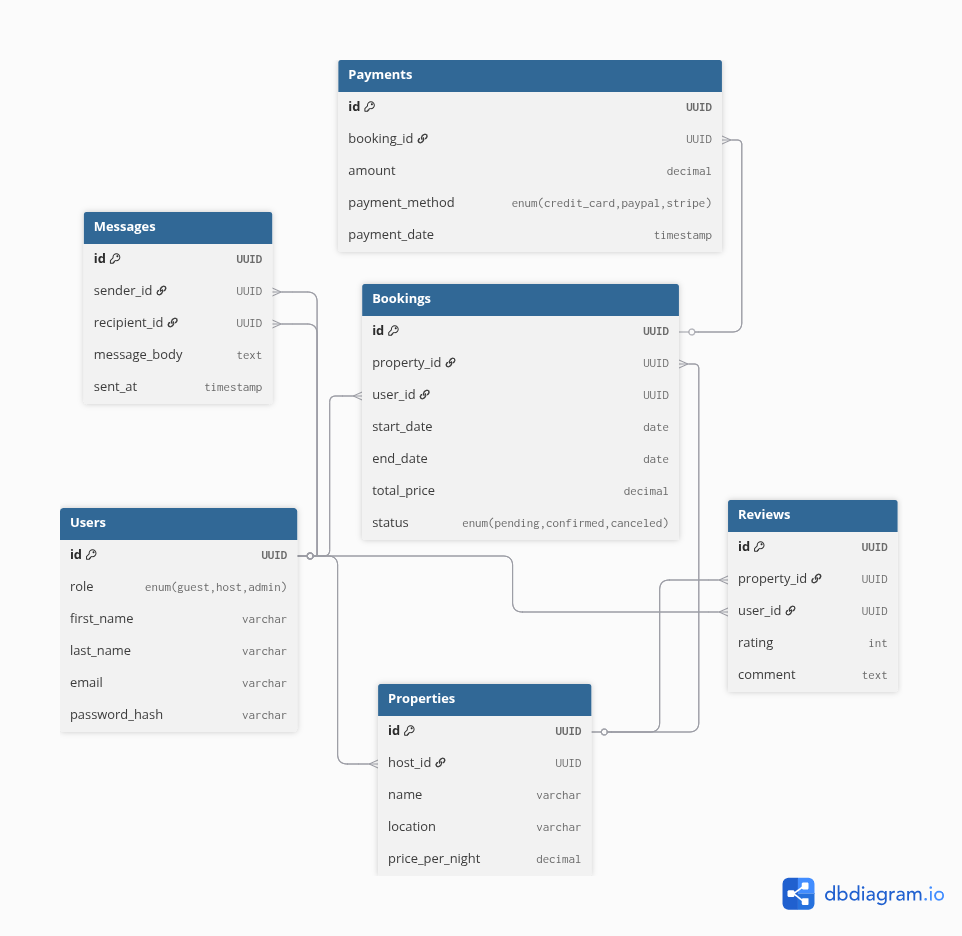

# 1️⃣ Map Backend Features to “Tables” in dbdiagram

We’ll treat backend modules as tables, even if they are not database tables, so we can draw a visual diagram of features and their connections.

## Suggested Modules & Relationships

| Module / Table | Attributes / Notes                                         | Relationships                                    |
| -------------- | ---------------------------------------------------------- | ------------------------------------------------ |
| **Users**      | user authentication, profile management, role-based access | Sends messages, makes bookings, leaves reviews   |
| **Properties** | CRUD management, availability, pricing, photos             | Belongs to a host (user), has bookings & reviews |
| **Bookings**   | start/end dates, total price, status                       | Belongs to property and user, linked to payment  |
| **Payments**   | amount, method, status                                     | Linked to booking                                |
| **Reviews**    | rating, comment                                            | Linked to property and user                      |
| **Messages**   | sender, recipient, message body                            | Linked to users (sender & recipient)             |

```sql
Table Users {
  id UUID [pk] // Primary key for authentication & profile
  role enum('guest','host','admin') // User role
  first_name varchar
  last_name varchar
  email varchar
  password_hash varchar
}

Table Properties {
  id UUID [pk] // Property ID
  host_id UUID // References Users.id
  name varchar
  location varchar
  price_per_night decimal
}

Table Bookings {
  id UUID [pk]
  property_id UUID // References Properties.id
  user_id UUID // References Users.id
  start_date date
  end_date date
  total_price decimal
  status enum('pending','confirmed','canceled')
}

Table Payments {
  id UUID [pk]
  booking_id UUID // References Bookings.id
  amount decimal
  payment_method enum('credit_card','paypal','stripe')
  payment_date timestamp
}

Table Reviews {
  id UUID [pk]
  property_id UUID // References Properties.id
  user_id UUID // References Users.id
  rating int
  comment text
}

Table Messages {
  id UUID [pk]
  sender_id UUID // References Users.id
  recipient_id UUID // References Users.id
  message_body text
  sent_at timestamp
}

// Relationships (no notes on Ref lines)
Ref: Properties.host_id > Users.id
Ref: Bookings.user_id > Users.id
Ref: Bookings.property_id > Properties.id
Ref: Payments.booking_id > Bookings.id
Ref: Reviews.user_id > Users.id
Ref: Reviews.property_id > Properties.id
Ref: Messages.sender_id > Users.id
Ref: Messages.recipient_id > Users.id
```

