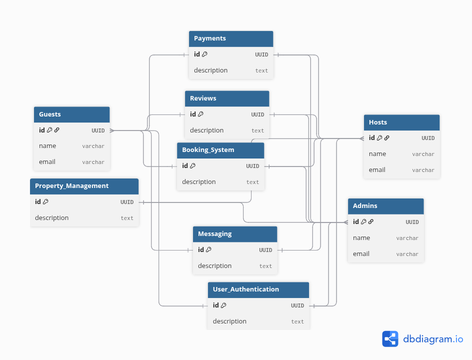

# Airbnb Clone Use Case Diagram



## Usecase diagram scripts
```sql
Project "Airbnb Clone Use Cases" {

}
```
## Actors as **tables**
```sql
Table Guests {
  id UUID [pk]
  name varchar
  email varchar
}

Table Hosts {
  id UUID [pk]
  name varchar
  email varchar
}

Table Admins {
  id UUID [pk]
  name varchar
  email varchar
}
```

## Use Cases as "tables" representing functionalities
```sql
Table User_Authentication {
  id UUID [pk]
  description text // Register, Login, Logout, Password Reset
}

Table Property_Management {
  id UUID [pk]
  description text // Add, Update, Delete, View Properties
}

Table Booking_System {
  id UUID [pk]
  description text // Create booking, View booking, Cancel booking
}

Table Payments {
  id UUID [pk]
  description text // Make payment, Refund, Payment status
}

Table Reviews {
  id UUID [pk]
  description text // Leave review, View reviews
}

Table Messaging {
  id UUID [pk]
  description text // Send message, Receive message
}

// Interactions (using FK relationships to show actors interacting with use cases)
Ref: Guests.id > User_Authentication.id
Ref: Hosts.id > User_Authentication.id
Ref: Admins.id > User_Authentication.id

Ref: Hosts.id > Property_Management.id
Ref: Admins.id > Property_Management.id

Ref: Guests.id > Booking_System.id
Ref: Hosts.id > Booking_System.id
Ref: Admins.id > Booking_System.id

Ref: Guests.id > Payments.id
Ref: Hosts.id > Payments.id
Ref: Admins.id > Payments.id

Ref: Guests.id > Reviews.id
Ref: Hosts.id > Reviews.id
Ref: Admins.id > Reviews.id

Ref: Guests.id > Messaging.id
Ref: Hosts.id > Messaging.id
Ref: Admins.id > Messaging.id
```